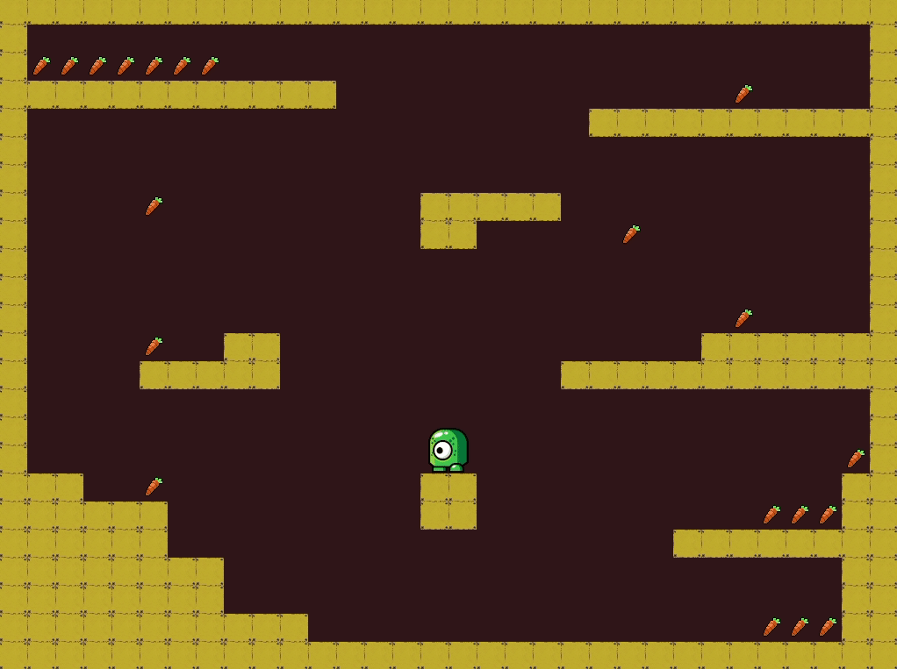

# Glossy Haskell Game



## Annotated code
Read post with [annotated code](https://bergsans.net/essays/2020-11-01-making-a-small-game-with-gloss).

## Installation
```
stack run
```

## Assets

All assets are from [Open Game Art](https://opengameart.org/).
